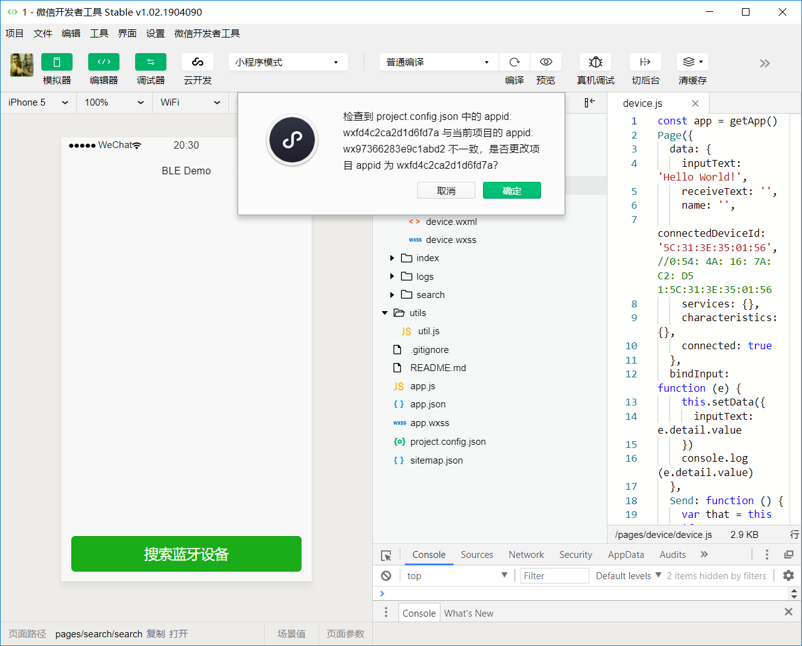

# appID

## 自己的appID在哪里

登录[微信公众平台](https://mp.weixin.qq.com/)，找到**设置**，往下拉就能看到了。

## ID不是开发者的



如图发现appID不一致，可以到以下文件`<path>\project.config.json`中，找到

```json
"compileType": "miniprogram",
"libVersion": "2.9.3",
"appid": "wxfd4c2ca2d1d6fd7a",
"projectname": "miniprogram-4",
"debugOptions": {
"hidedInDevtools": []
```

修改这个appID为自己的即可。
